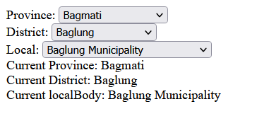

# nepal-localbodies-react
### NPM Package for  React to provide nepal local bodies for form
It is a custom react hook  which returns 4 value:
1. localBodySelected: array of local bodies for selected district
2. districtSelected: array of districts for selected state
3. stateSelected: selected state
4. template: template for local body form


## Setup
1. Install dependencies
```bash
npm install nepal-localbodies-react
```
2. Import the package
```js
import useDistrictComponent from "nepal-localbodies-react/localBodies";
```
3. Use the package

   *Destructure the returned values*
```js 
const {template, districtSelected, localBodySelected, provinceSelected} = useDistrictComponent();
```
4. Use them in your form
```js
import useDistrictComponent from "nepal-localbodies-react/localBodies";

function App() {
const {template, districtSelected, localBodySelected, provinceSelected} = useDistrictComponent();

  return (
    <div className="App">
      {template}
      <div>Current Province: {provinceSelected}</div>
      <div>Current District: {districtSelected}</div>
      <div>Current localBody: {localBodySelected}</div>
    </div>
  )
}

export default App;
```
Output:



